# ⚡ Blade Runner A

> **"I build AI systems, not just models."**

---

  <h3>👋 Hi, I’m Anvin</h3>
  
Building end-to-end AI and GenAI systems — from classical machine learning to large language models deployed on real infrastructure.

---

## 🚀 What I’ve Built

### 🔹 Medical GenAI Assistant

- End-to-end RAG-based medical question answering system
- FAISS vector search with transformer embeddings
- Fine-tuned Mistral-7B using QLoRA (4-bit)
- FastAPI backend + Next.js frontend
- Deployed on multi-GPU infrastructure

### 🔹 LLM Orchestration Framework _(in progress)_

- Tool routing and multi-step reasoning
- Lightweight agent workflows
- Focused on real-world GenAI system design

### 🔹 LLM Monitoring & Evaluation _(in progress)_

- Latency and retrieval-quality tracking
- Hallucination risk indicators
- Practical evaluation beyond accuracy

---

## 🧠 What I’m Focused On

- **Machine Learning & Deep Learning fundamentals**
- **Transformer architectures & Large Language Models**
- **Retrieval-Augmented Generation (RAG)**
- **Fine-tuning and optimizing LLMs** (QLoRA, PEFT, quantization)
- **Production-ready AI backends and deployments**

---

## 📊 System Metrics

## 🐍 Contribution Graph

---

## 🤝 Connect with Me

- **Main Account:** [Anvin](https://github.com/Anvin)
- **Alt Account 1:** [AnvinX1](https://github.com/AnvinX1)
- **Alt Account 2:** [AnvinX2](https://github.com/AnvinX2)

---

  

